# CI2025_lab2

## Overview

This repository contains my solution for **Lab 2** of the course *Computational Intelligence (CI2025/26)*. It consists in solving several instances of the **Traveling Salesman Problem (TSP)** using **Evolutionary Computation (EC)**.

---

## Problem definition

The TSP is a classical combinatorial optimization problem. where a set of cities must be visited exactly once and the goal is to find the **shortest possible tour** returning to the starting city.

Given a set of `n` cities and a distance matrix `D`, the goal is to find the shortest possible tour that visits each city exactly once and returns to the starting point.

The distance matrix may contain positive or negative weights, allowing exploration of both standard and modified TSP variants.

---

## Representation of solutions

Each solution (tour) is represented as a **permutation** of integers from `0` to `N-1`, where `N` is the number of cities:

```
tour = [0, 4, 2, 1, 3]
```

This represents visiting city 0 → 4 → 2 → 1 → 3 → 0.

---

## Algorithm description

### 1. Initialization (tour creation and initial population)

The algorithm begins with an initial population of tours, initialized partly at random and partly using a **greedy heuristic** (nearest neighbor).  
This hybrid approach seems to be the best working one.
I tried with a random tour at first but I obtained much worse results. The functions for it are still part of the code, so it's possible to compare the two.

---

### 2. Evolutionary process

The main evolutionary loop repeats for a fixed number of generations:

1. **Fitness evaluation** — Each tour’s total length is computed.
2. **Selection** — Parents are selected via **tournament selection**, favoring shorter tours (with k=3).
3. **Crossover** — Two parents generate offspring using **Ordered Crossover (OX)**. Also **Inver-Over Crossover** was tried, but it made computing time much longer.
4. **Mutation** — Offspring are randomly perturbed through **inversion** mutation, that worked better then both **swap** and **insert** mutation.
5. **Elitism** — The best individuals from the previous generation are preserved, with a growing percentage (from 2% to 5%). This seemed to work better than a fixed %.

All of the functions that were tried during the process are still part of the code even though they're not used.
I used ChatGPT to help writing the inver_over_crossover and inver_over_crossover_fast functions.

---

## Experimental Results

For each instance, the best tour and computation time are recorded, along with the corresponding convergence plot.

**Problem_g_10:**
- Best distance: 1497.66
- Time taken: 6.07 s
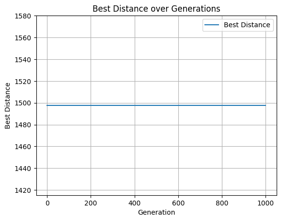

**Problem_g_20:**
- Best distance: 1755.51
- Time taken: 6.35 s
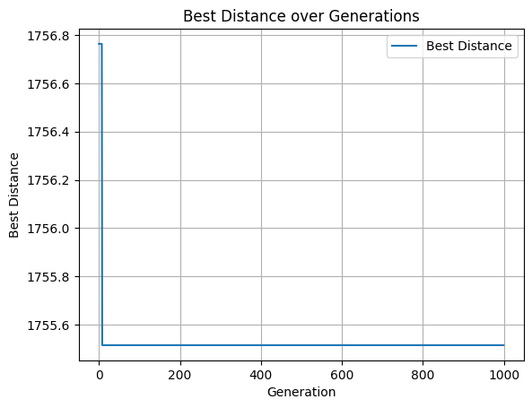

**Problem_g_50:**
- Best distance: 2677.21
- Time taken: 7.10 s
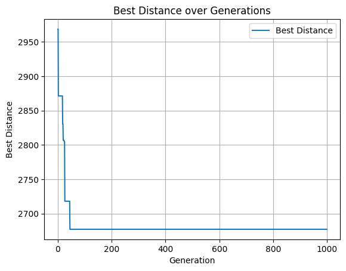

**Problem_g_100:**
- Best distance: 4136.06
- Time taken: 8.39 s
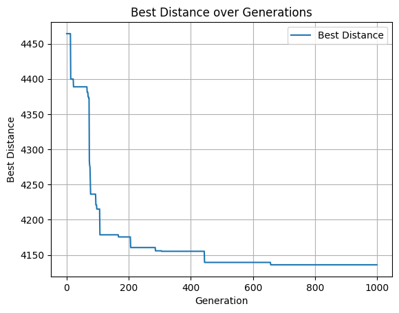

**Problem_g_200:**
- Best distance: 5752.18
- Time taken: 11.01 s
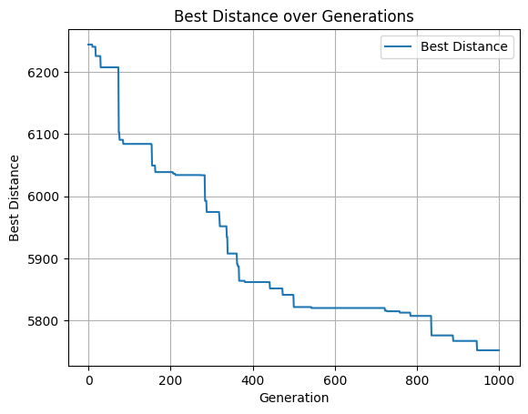

**Problem_g_500:**
- Best distance: 9166.13
- Time taken: 18.52 s
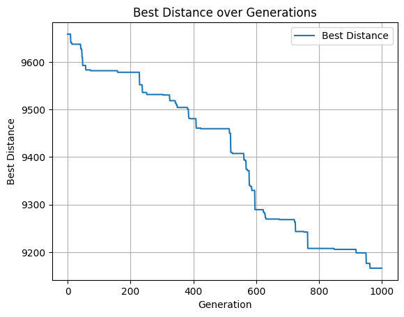

**Problem_g_1000:**
- Best distance: 13731.26
- Time taken: 31.40 s
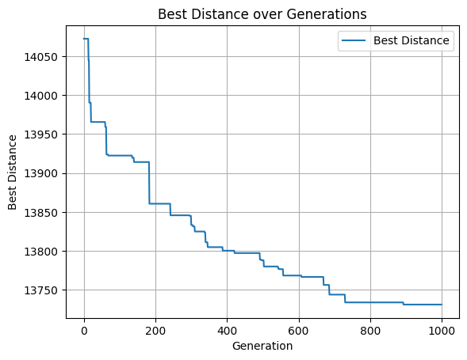

**Problem_r1_10:**
- Best distance: 184.27
- Time taken: 6.28 s
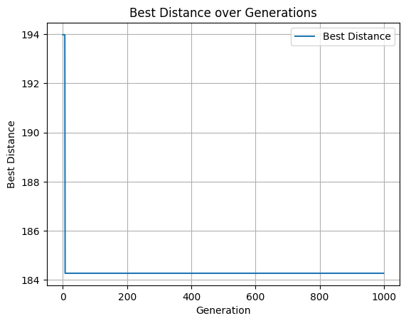

**Problem_r1_20:** 
- Best distance: 340.86 
- Time taken: 6.62 s
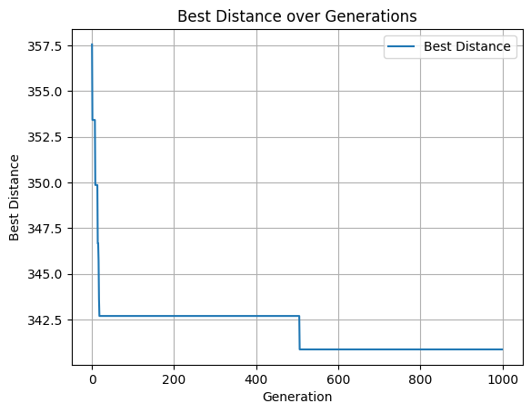

**Problem_r1_50:** 
- Best distance: 574.42 
- Time taken: 7.61 s
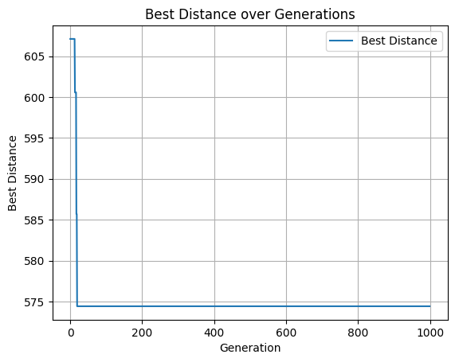

**Problem_r1_100:**
  - Best distance: 738.81
  - Time taken: 8.92 s
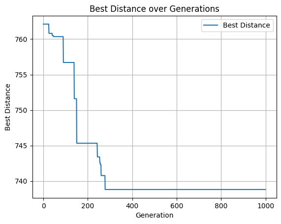

**Problem_r1_200:**
- Best distance: 1116.04
- Time taken: 11.67 s
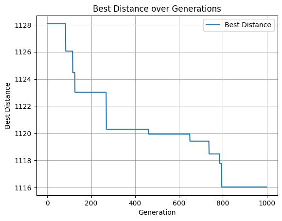

**Problem_r1_500:** 
- Best distance: 1754.14 
- Time taken: 19.76 s
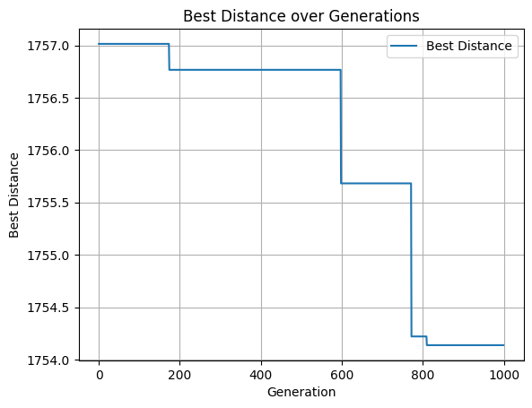

**Problem_r1_1000:** 
- Best distance: 2542.70 
- Time taken: 35.30 s
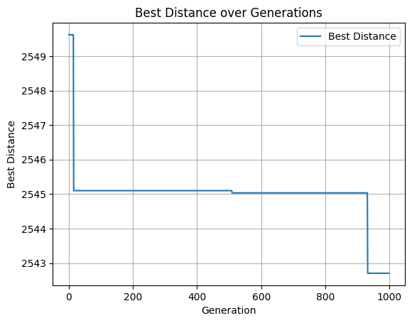

**Problem_r2_10:** 
- Best distance: -411.70 
- Time taken: 7.22 s
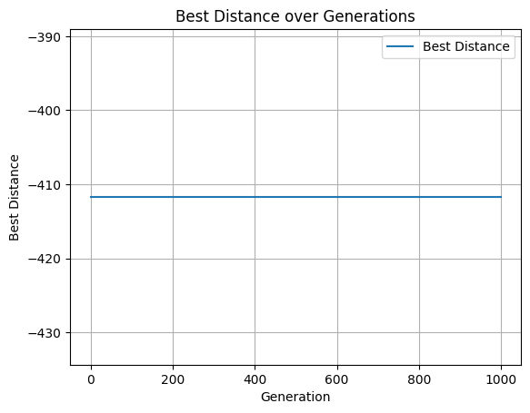

**Problem_r2_20:** 
- Best distance: -796.86 
- Time taken: 7.37 s
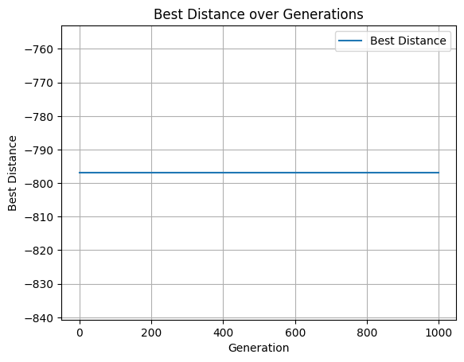

**Problem_r2_50:**
- Best distance: -2232.38 
- Time taken: 8.20 s


**Problem_r2_100:** 
- Best distance: -4667.68 
- Time taken: 9.66 s 


**Problem_r2_200:**
- Best distance: -9603.77 
- Time taken: 12.28 s 


**Problem_r2_500:** 
- Best distance: -24529.66 
- Time taken: 19.96 s
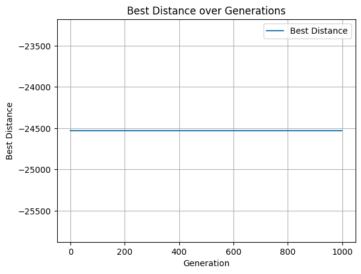

**Problem_r2_1000:** 
- Best distance: -49402.98 
- Time taken: 33.31 s
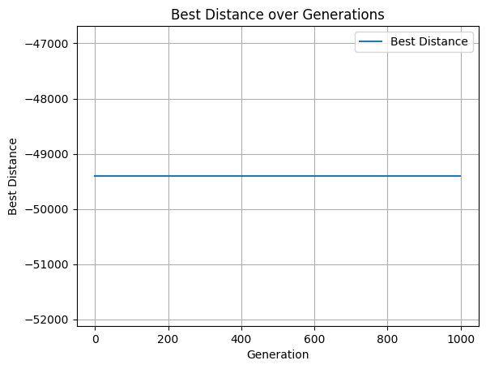


---

## Final considerations:
For the r2 problems, the behavior is strange: it looks like the greedy initial solutions already finds a local minimum that is very hard to escape.
I think it may be the global minimum though, because using a random initial solution instead of the greedy it starts from a worse distance and then explores the space, without ever reaching the values reached with the greedy.


---

**Author:** [Riccardo Dattena (helped by ChatGPT for a couple of lines)]  
**Course:** Computational Intelligence (CI2025/26)  
**Lab 2 — Traveling Salesman Problem (EC)**
